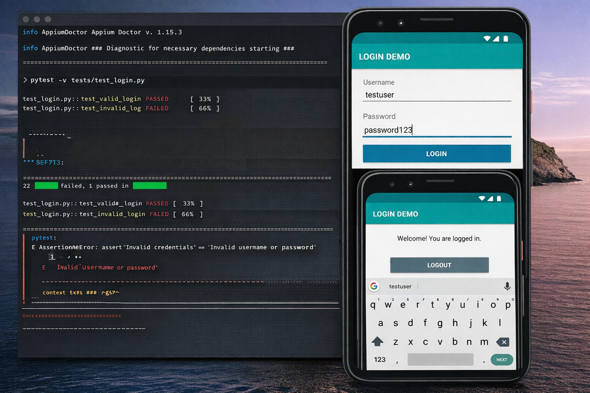

# 📱 Mobile App Automation Testing Exercises (Python)

## 📌 Project Overview
This repository contains **mobile application automation testing exercises** implemented using **Python and Appium**.  
The project is designed to demonstrate **real-world mobile test automation practices**, focusing on maintainable test design, reusable components, and structured execution.

It is suitable for:
- QA Engineers transitioning to automation
- SDETs practicing mobile automation
- Learning Appium with Python using industry patterns

---

## 🎯 Objectives
- Automate common mobile application workflows
- Apply Page Object Model (POM) design pattern
- Validate UI behavior and navigation
- Capture failures with screenshots
- Generate execution reports
- Understand mobile automation setup and execution flow

---

## 🧰 Tech Stack

### Core Technologies
- **Language:** Python 3.x
- **Mobile Automation:** Appium
- **Test Framework:** Pytest / unittest
- **Design Pattern:** Page Object Model (POM)

### Supporting Tools
- Selenium WebDriver
- Android Emulator / Real Device
- Appium Server
- PyCharm / VS Code

---

## 📁 Project Structure

```text
Mobile-App-Automation-Testing-Exercises-Python/
├── tests/                   # Test cases
│   ├── test_login.py
│   ├── test_navigation.py
│   └── test_settings.py
├── pages/                   # Page Object classes
│   ├── login_page.py
│   ├── home_page.py
│   └── settings_page.py
├── utils/                   # Utilities and helpers
│   ├── driver_setup.py
│   ├── config_reader.py
│   └── wait_utils.py
├── data/                    # Test data
│   ├── credentials.json
│   └── testdata.csv
├── reports/                 # Execution reports
├── screenshots/             # Failure screenshots
├── requirements.txt         # Python dependencies
└── README.md
```

---

## ⚙️ Installation & Setup
### 1️⃣ Clone the Repository

```bash
git clone https://github.com/itsVimalkumaR/Mobile-App-Automation-Testing-Exercises-Python.git
cd Mobile-App-Automation-Testing-Exercises-Python
```

### 2️⃣ Install Python Dependencies
Ensure Python 3.8+ is installed.

```bash
pip install -r requirements.txt
```

Typical dependencies include:
- appium-python-client
- selenium
- pytest
- pytest-html

### 3️⃣ Install Appium
Install Appium globally:

```bash
npm install -g appium
```

(Optional) Install Appium Desktop for inspecting mobile elements.

### 4️⃣ Device / Emulator Setup
- Install Android SDK
- Set `ANDROID_HOME` environment variable
- Start Android emulator or connect a real device
- Enable USB debugging (for real devices)

---

## 🧪 Test Execution
### Start Appium Server

```bash
appium
```

### Run Tests Using Pytest
```bash
pytest -v -s tests/ --html=reports/report.html
```

### Run Using unittest
```bash
python -m unittest discover -s tests
```

---

## 🔄 Test Execution Flow
1. Appium server starts
2. Device or emulator is detected
3. Driver session is created
4. Test cases execute via Page Objects
5. Failures capture screenshots
6. Reports are generated

---

## 📸🎥 Demo & Screenshots
> Add actual files inside the `screenshots/` folder

### Automation Execution


### Test Report


### Failure Screenshot


---

## 📌 Recommended GIF Tools
- **Windows:** ScreenToGif
- **macOS:** Kap
- **Linux:** Peek

---

## 🔁 CI/CD Integration (GitHub Actions)
This project supports automated execution via** GitHub Actions** for continuous validation.

**Workflow Capabilities**
- Trigger on push & pull request
- Setup Python environment
- Install dependencies
- Execute automation tests
  
**Sample Workflow File**
Create:
```bash
.github/workflows/mobile-automation.yml
```

```yaml
name: Mobile Automation Tests

on:
  push:
    branches: [ main ]
  pull_request:
    branches: [ main ]

jobs:
  test:
    runs-on: ubuntu-latest

    steps:
      - name: Checkout Repository
        uses: actions/checkout@v3

      - name: Setup Python
        uses: actions/setup-python@v4
        with:
          python-version: '3.9'

      - name: Install Dependencies
        run: |
          pip install -r requirements.txt

      - name: Execute Tests
        run: |
          pytest -v tests/
```

> ℹ️ Mobile tests are typically run on **self-hosted runners** or **cloud device farms**.

---

## 🧪 Test Coverage
Currently covers:
- Login and authentication flows
- Navigation validations
- Input field validation
- Positive and negative scenarios
- Screenshot capture on failure

Planned enhancements:
- Parallel execution
- Cloud device execution
- Android & iOS separation
- CI report publishing

---

##🤝 Contribution Guidelines
1. Fork the repository
2. Create a feature branch
```bash
git checkout -b feature/new-test
```
3. Follow existing project structure
4. Avoid hard-coded test data
5. Run tests before committing
6. Raise a Pull Request with details

---

## 👤 Author

**Vimalkumar Murugesan**

Senior Manual & Automation Test Engineer

🔗 [LinkedIn](https://www.linkedin.com/in/vimalkumar-m/)

---

## 📄 License

This project is open-source and intended for learning and educational purposes.
